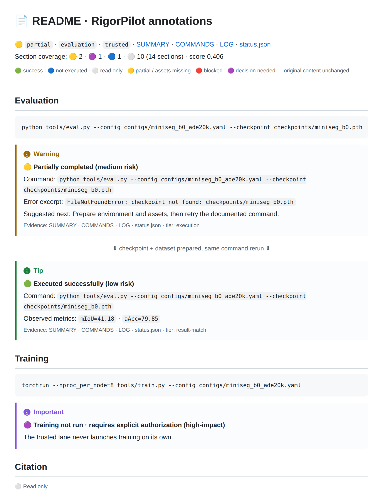
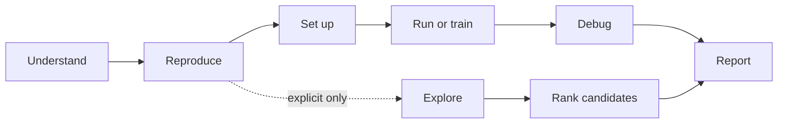
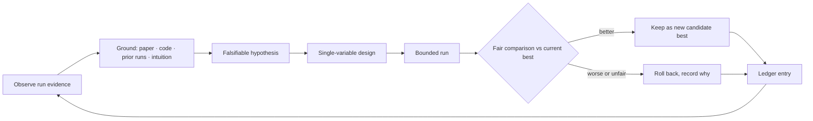

# RigorPilot Skills

[](https://skillselion.com/skills/lllllllama/rigorpilot-skills/paper-context-resolver)

Research-first Agent Skills for Deep Learning Experiments: a harness that turns README commands into bounded runs and
auditable evidence for deep-learning repositories. Trusted reproduction is the
default; exploration requires explicit authorization.

<p>
  <a href="./README.md">English</a> |
  <a href="./README.zh-CN.md">简体中文</a>
</p>

<p>
  <a href="https://github.com/lllllllama/RigorPilot-Skills/actions/workflows/validate.yml"></a>
  <a href="https://skillselion.com/skills/lllllllama/rigorpilot-skills/ai-research-reproduction"></a>
  <a href="https://skills.sh/lllllllama/rigorpilot-skills"></a>
  <a href="https://github.com/lllllllama/RigorPilot-Skills/stargazers"></a>
  <a href="LICENSE"></a>
  <a href="https://agentskills.io"></a>
  
  
  
</p>

<p align="center">
  <a href="#examples"><strong>Examples</strong></a> ·
  <a href="#evidence"><strong>Real-repo Evidence</strong></a> ·
  <a href="#quick-start"><strong>Quick Start</strong></a> ·
  <a href="docs/PROJECT_GUIDE.md"><strong>Learn & Roadmap</strong></a> ·
  <a href="#-choose-an-entry-point"><strong>Skill Index</strong></a>
</p>

<a id="examples"></a>

## 📄 At a Glance: How RigorPilot Annotates a README

RigorPilot reads the target repository's original README directly. Every word,
blank line, and line ending stays intact; RigorPilot only inserts a status card
at the end of each section. You can see what ran, what happened, and why the
agent stopped before opening the underlying evidence.

| Original README | In-place RigorPilot verdict | Auditable evidence |
|---|---|---|
| Commands, prose, badges, images, GIFs, videos, and HTML remain unchanged | Success, partial, blocked, read-only, or authorization required | `SUMMARY.md`, `COMMANDS.md`, `LOG.md`, `status.json` |

🟢 success · 🔵 not executed · ⚪ read only · 🟡 partial · 🔴 blocked · 🟣 decision required

<div align="center">
  
  <br/>
  <sub>Historical interface illustration: missing assets, result display and authorization boundaries. Execution provenance is not independently verified; excluded from benchmarks.</sub>
</div>

| Historical illustration (not capability evidence) | What it shows |
|---|---|
| [First attempt](examples/annotated-readme-demo/first-run/ANNOTATED_README.md) | 🟡 missing-checkpoint error display · 🟡 dataset not ready · 🟣 training awaits authorization |
| [After assets are ready](examples/annotated-readme-demo/after-setup/ANNOTATED_README.md) | 🟢 success and `mIoU` / `aAcc` display; not independently verified execution results |

### Verified on a Real Public Repository: micrograd

| Actual execution | README fidelity | Inspect directly |
|---|---|---|
| 🟢 `2` tests passed in 7.62 seconds | `8` headings = `8` annotations; stripped SHA-256 exactly matches the original file | [original repository](https://github.com/karpathy/micrograd/tree/7bc720e951fe422b8f8814aa5aa1b64121d26b4c) · [full annotated README with retained repo files](benchmark_outputs/showcases/micrograd/repo/RIGORPILOT_README.md) · [benchmark report](benchmark_outputs/external_micrograd.json) |

<a id="evidence"></a>

## 🧪 Real Public Repository Runs and Boundary Checks

<table>
  <tr>
    <td align="center" width="50%">
      <a href="benchmark_outputs/showcases/micrograd/repo/RIGORPILOT_README.md"></a><br/>
      <b>micrograd · correctness</b><br/>
      <sub>🟢 2 tests passed in 7.62 s · 8 headings = 8 annotations<br/>repository files retained · SHA-256 exact</sub><br/>
      <a href="benchmark_outputs/showcases/micrograd/repo/RIGORPILOT_README.md">Open RigorPilot README inside the real repo →</a>
    </td>
    <td align="center" width="50%">
      <a href="benchmark_outputs/showcases/mingpt/repo/RIGORPILOT_README.md"></a><br/>
      <b>minGPT · risk boundary</b><br/>
      <sub>🔵 Test selected · no implicit model download<br/>11 headings = 11 annotations · SHA-256 exact</sub><br/>
      <a href="benchmark_outputs/showcases/mingpt/repo/RIGORPILOT_README.md">Open RigorPilot README inside the real repo →</a>
    </td>
  </tr>
  <tr>
    <td align="center" width="50%">
      <a href="benchmark_outputs/showcases/pytorch-mnist/repo/mnist/RIGORPILOT_README.md"></a><br/>
      <b>PyTorch MNIST · data and metric capture</b><br/>
      <sub>🟡 bounded startup · loss 0.038893<br/>1 heading = 1 annotation · SHA-256 exact</sub><br/>
      <a href="benchmark_outputs/showcases/pytorch-mnist/repo/mnist/RIGORPILOT_README.md">Open RigorPilot README inside the real repo →</a>
    </td>
    <td align="center" width="50%">
      <a href="benchmark_outputs/showcases/nanogpt-shakespeare/repo/RIGORPILOT_README.md"></a><br/>
      <b>nanoGPT Shakespeare · bounded training</b><br/>
      <sub>🟡 train loss 4.1676 · validation loss 4.1649<br/>11 headings = 11 annotations · SHA-256 exact</sub><br/>
      <a href="benchmark_outputs/showcases/nanogpt-shakespeare/repo/RIGORPILOT_README.md">Open RigorPilot README inside the real repo →</a>
    </td>
  </tr>
</table>

<p align="center">
  <a href="benchmark_outputs/EXTERNAL_REPRODUCTIONS.md"><b>Browse all four reproductions in one evidence index →</b></a>
</p>

**Recorded result:** `61/61` regression scripts and `4/4` historical external protocols
passed; the external suite took `251.0 s`, used at most `98.67 MiB` per
workspace, made `0` API calls, removed every temporary workspace, and retained
about `17.9 MiB` of tracked repository showcase snapshots.

[Latest suite JSON](benchmark_outputs/external_suite_latest.json) ·
[history](benchmark_outputs/external_suite_history.jsonl) ·
[case definitions](benchmarks/external_cases.json) ·
[methodology and limits](benchmarks/README.md)

> `partial` proves bounded startup, metric capture, timeout handling, source
> integrity, and cleanup. It does not prove convergence or reproduce a paper score.

<a id="quick-start"></a>

## 🚀 Install

All skills:

```bash
npx skills add lllllllama/rigorpilot-skills --all
```

Only the trusted reproduction skill:

```bash
npx skills add lllllllama/rigorpilot-skills --skill ai-research-reproduction
```

After installation, open the target repository in a Skills-capable agent:

> Use ai-research-reproduction. Read the original README and select the smallest documented evaluation. Stop for approval before large downloads or long training; preserve the source and record execution evidence.

The main skill works alone; install all skills when using companion entrypoints.
Your existing agent loads the skill; the standalone model runner is optional.

To learn recovery from a clone of this project:

```bash
python scripts/run_harness_lab.py
```

**Offline teaching lab: scripted decisions, real processes.** No API, GPU or model
downloads. Failure → preparation → pause → process restart → independent checks;
not evidence of live-model capability. Requires Python 3.11+ and Git.
[Project assessment & learning roadmap](docs/PROJECT_GUIDE.md) ·
[Original lab README](examples/harness-lab/README.md)

<details>
<summary>Other install paths, agent commands, and runtime controls</summary>

Optional model/tool loop: [run and resume a reviewed task](skills/ai-research-reproduction/references/agent-runner.md).
Engineering tests cover recovery and independent verification; live-provider
acceptance remains blocked by gateway HTTP 502. [P0/P1 evidence and limits](docs/P0_P1_DELIVERY.md).

Claude Code commands: `/ai-research-reproduction`, `/ai-research-explore`,
`/analyze-project`, `/safe-debug`.

Each executed command receives a run ID and writes atomic state, append-only
events, resource samples, and complete stdout/stderr under
`<output-dir>/_runtime/<run_id>/`. Cancellation, restart recovery, and explicit
retry preserve process and attempt lineage. Model profiles record identity and
capabilities without credentials.

The preferred source is `lllllllama/rigorpilot-skills`; the legacy
`lllllllama/ai-paper-reproduction-skills` slug remains a compatibility fallback.

</details>

## 📄 Output Bundle

Every run writes the original README plus section-level verdicts to
`repro_outputs/ANNOTATED_README.md`. Each verdict links to `SUMMARY.md`,
`COMMANDS.md`, `LOG.md`, and `status.json`; the header records a rubric-style
coverage score. 🟢 success · 🔵 not executed · ⚪ read only · 🟡 partial ·
🔴 blocked · 🟣 decision required.

## 🎯 Choose an Entry Point

| What you want to do | RigorPilot display name | Current skill slug |
|---|---|---|
| Reproduce a deep learning repository from README commands | Rigor Reproduce | `ai-research-reproduction` |
| Analyze repository structure, entrypoints, and risks without editing | Rigor Analyze / Audit | `analyze-project` |
| Prepare environment, datasets, weights, and cache assumptions | Rigor Setup | `env-and-assets-bootstrap` |
| Run documented inference or evaluation conservatively | Rigor Run | `minimal-run-and-audit` |
| Start or verify training conservatively | Rigor Train | `run-train` |
| Debug a failure safely, diagnose before patching | Rigor Debug / Audit | `safe-debug` |
| Explore candidates on top of `current_research` | Rigor Explore | `ai-research-explore` |
| Implement candidate changes on an isolated branch | Rigor Improve | `explore-code` |
| Run small probes or short-cycle experiments | Rigor Explore / Improve | `explore-run` |

Bundled helper skills are usually called by orchestrators:

- `repo-intake-and-plan`
- `paper-context-resolver`

## 🛣️ Lane Model

### 🔒 Trusted Lane

Use this lane for reproduction, setup, read-only analysis, conservative
execution, training verification, and safe debugging.

- Primary entrypoint: `ai-research-reproduction`
- Output directories: `repro_outputs/`, `train_outputs/`, `analysis_outputs/`, `debug_outputs/`
- Core requirement: preserve scientific meaning, minimize semantic changes, and record assumptions, blockers, and evidence.

### 🧪 Explore Lane

Use this lane only when the researcher explicitly authorizes candidate-only
exploration.

- Primary entrypoint: `ai-research-explore`
- Leaf skills: `explore-code`, `explore-run`
- Output directory: `explore_outputs/`
- Key anchor: `current_research`

`current_research` should be a durable research state such as a branch, commit,
checkpoint, run record, or already-trained local model state. Explore outputs
are always candidate results. They must not claim trusted reproduction success,
complete benchmark results, or verified novelty.

## 🔬 Core Research Principles

1. Do not chase scores blindly: score gains must have explanatory value.
2. Do not claim novelty lightly: novelty needs literature, code, or experimental evidence.
3. Do not break comparability silently: if evaluation conditions change, say that results are not directly comparable.
4. Do not disguise engineering fixes as research contributions.
5. Do not leave collaborators out of control: important changes must be auditable, reversible, and explainable.

See [references/research-rigor-principles.md](references/research-rigor-principles.md)
and [references/agent-operating-principles.md](references/agent-operating-principles.md).

## 🔁 Lifecycle View

The repository follows a shallow lifecycle-oriented routing model:



The lifecycle helps the agent choose the right lane and evidence target. It
does not force every repository into a fixed implementation sequence.

## 🧠 Research Thinking Loop

Agents implement well but often think in engineering steps. Once the
researcher freezes the evaluation contract and explicitly authorizes
exploration, `ai-research-explore` runs a codified **greedy research cycle** —
from observation to a fair keep-or-rollback decision
([full contract](references/research-thinking-loop.md)):



- Every hypothesis carries a **labeled evidence anchor** — `paper`, `code`,
  `prior-run`, or `intuition`; unanchored ideas queue in the idea bank and
  never execute.
- **Greedy applies to selection, not honesty**: a keep requires comparable
  evidence under the frozen contract; ties favor the simpler, cheaper change.
- Underneath: hard-gated idea ranking, atomic idea decomposition, three-layer
  implementation fidelity (planned / heuristic / observed), and
  executor-emitted file-level evidence.
- Lineage: adapts the greedy solution-space search of
  [AIDE](https://arxiv.org/abs/2502.13138) and the managed agentic tree search
  of [AI-Scientist-v2](https://arxiv.org/abs/2504.08066), constrained by
  RigorPilot's comparability-first gates.

## 🌱 Continuous Learning

The shipped skills are an **immutable universal rigor core**; personalization
lives in a user-owned overlay
([policy](references/continuous-learning-policy.md)):

- Failed runs — and their later fixes — are auto-recorded as one-line lessons
  in `~/.rigorpilot/lessons.jsonl` (opt out with `RIGORPILOT_LESSONS=0`).
- `python shared/scripts/lessons_store.py summarize` distills them into
  `~/.rigorpilot/PERSONAL_RIGOR.md`, which skills consult at run start as the
  researcher's standing preferences and known pitfalls.
- Hard rules: lessons are **advisory only** — they never relax rigor gates,
  never store secrets, never edit skill files. Delete the folder and the
  skills return to the universal base.

## 🧾 Suggested Research Evidence

| Artifact | Purpose |
|---|---|
| `SCIENTIFIC_CHANGELOG.md` | Records what changed, why it changed, whether it affects scientific meaning, and whether it remains comparable. |
| `COMPARABILITY_REPORT.md` | Explains whether results can still be compared to the README, paper, baseline, or SOTA reference. |
| `REPRODUCIBILITY_NOTES.md` | Records commands, configs, seeds, checkpoints, datasets, environment assumptions, and known gaps. |
| `NOVELTY_CLAIM.md` | States possible novelty as a hypothesis, with supporting evidence, missing evidence, limitations, and required ablations. |
| `ABLATION_PLAN.md` | Describes which variables must be isolated to validate a candidate change. |
| `EXPERIMENT_LEDGER.md` | Records runs, metrics, commands, artifacts, changed files, and evidence status. |

`SCIENTIFIC_CHANGELOG.md`, `COMPARABILITY_REPORT.md`, and `EXPERIMENT_LEDGER.md`
are already generated by standard trusted / explore writers. The remaining names
(`REPRODUCIBILITY_NOTES.md`, `NOVELTY_CLAIM.md`, `ABLATION_PLAN.md`) are
future-compatible evidence concepts.

## 📁 Output Directories

| Directory | Contents |
|---|---|
| `repro_outputs/` | Trusted reproduction bundle, including `ANNOTATED_README.md` |
| `train_outputs/` | Trusted training bundle |
| `analysis_outputs/` | Read-only analysis, research map, change map, eval contract, idea seeds, atomic idea map, implementation fidelity, and related outputs |
| `debug_outputs/` | Safe debug diagnosis and patch plan |
| `sources/` | Free-first research lookup records, repo-local extraction, and auditable index |
| `explore_outputs/` | Changeset, idea gate, experiment plan, manifest, ledger, candidate ranking, and related outputs |

## 🧩 Campaign Inputs

`ai-research-explore` still accepts `variant_spec.json`, but
`research_campaign.json` or `research_campaign.yaml` is preferred for Rigor
Explore campaigns.

Durable core fields:

- `current_research`
- `task_family`
- `dataset`
- `benchmark`
- `evaluation_source`
- `sota_reference`
- `compute_budget`

Optional fields:

- `candidate_ideas`
- `variant_spec`
- `research_lookup`
- `idea_policy`
- `idea_generation`
- `source_constraints`
- `feasibility_policy`

See [skills/ai-research-explore/references/research-campaign-spec.md](skills/ai-research-explore/references/research-campaign-spec.md).

## 🌐 Multi-Agent, Multi-Model

RigorPilot is model-agnostic by construction:

- **Agent Skills standard** — every skill is a spec-compliant `SKILL.md`
  ([agentskills.io](https://agentskills.io)), the format adopted by Claude
  Code, OpenAI Codex, Cursor, VS Code, Gemini CLI, and 30+ other tools.
  `npx skills add lllllllama/rigorpilot-skills` works for any of them.
- **`AGENTS.md` routing** — the root [`AGENTS.md`](AGENTS.md) gives
  AGENTS.md-aware agents (Codex, Cursor, Copilot, Gemini CLI, Aider, Zed, …)
  the lane model, entrypoint table, and hard rules without any install step.
- **Same contract, any model** — SKILL.md instructions carry no
  model-specific tool syntax; the evidence bundles (`status.json`,
  `ANNOTATED_README.md`, …) are identical whichever model executes the run,
  so results stay comparable across GPT-, Claude-, and Gemini-based agents.
- **Per-skill client mirrors** — `skills/*/agents/openai.yaml` and
  `.claude/commands/*` keep Codex- and Claude-specific entry points in sync
  with the canonical contract.

## 🛠️ Local Install

Use the Python installer only when developing locally, needing a project-scoped
install, or manually targeting client directories.

```bash
python scripts/install_skills.py --client agents --target "$HOME/.agents/skills" --force
python scripts/install_skills.py --client codex --target "$HOME/.codex/skills" --force
python scripts/install_skills.py --client claude --target "$HOME/.claude/skills" --force
```

Project-scoped examples:

```bash
python scripts/install_skills.py --client agents --target ./.agents/skills --force
python scripts/install_skills.py --client claude --target ./.claude/skills --force
```

These commands are written to work in both Windows PowerShell and Linux shells.

## 💬 Example Prompts

**Trusted reproduction**

```text
Use ai-research-reproduction on this deep learning research repo. Stay README-first, prefer documented inference or evaluation, avoid unnecessary repo changes, and write outputs to repro_outputs/.
```

**Read-only analysis**

```text
Use analyze-project on this repo. Read the code, map the model and training entrypoints, and flag suspicious patterns without editing files.
```

**Safe debug**

```text
Use safe-debug on this traceback. Diagnose the failure first, propose the smallest safe fix, and do not patch until I approve.
```

**Candidate exploration**

```text
Use ai-research-explore with research_campaign.json. Treat the task family, dataset, evaluation source, and SOTA table as frozen inputs. Rank candidate ideas and write evidence outputs to analysis_outputs/ and explore_outputs/.
```

## ✅ Local Validation

Run everything (CI entrypoint):

```bash
python scripts/run_all_tests.py
```

Basic checks:

```bash
python scripts/validate_repo.py
python scripts/test_skill_registry.py
python scripts/test_trigger_boundaries.py
python scripts/test_operating_principles_structure.py
python scripts/test_claude_command_wrappers.py
python scripts/test_readme_selection.py
```

Core output and explore regressions:

```bash
python scripts/test_output_rendering.py
python scripts/test_readme_annotation.py
python scripts/test_train_output_rendering.py
python scripts/test_analysis_output_rendering.py
python scripts/test_safe_debug_output_rendering.py
python scripts/test_research_explore_dry_run.py
python scripts/test_research_explore_campaign_flow.py
python scripts/test_research_explore_artifact_consistency.py
python scripts/test_research_explore_variant_execution.py
python scripts/test_research_explore_nontraining_execution.py
python scripts/test_atomic_idea_decomposition.py
python scripts/test_idea_seed_generation.py
python scripts/test_implementation_fidelity.py
```

Install-related regressions:

```bash
python scripts/test_bootstrap_env.py
python scripts/test_install_targets.py
python scripts/test_setup_planning.py
```

## 🧭 Current Repo Snapshot

- `11` skills total: `9` public skills and `2` helper skills.
- `6` trusted-lane public skills and `3` explore-lane public skills.
- `4` project-scoped Claude Code wrappers under `.claude/commands/`.
- `59` root Python scripts, including `55` test scripts.
- Documentation and command examples are kept usable from both Windows PowerShell and Linux shells.

## ⚠️ Current Limits

- The persistent queue is a single-host, single-writer scheduler; resource
  requests provide admission control, not OS-level CPU, RAM, or GPU isolation.
- The external suite covers four repositories, but minGPT is selection-only
  and the two training cases prove bounded startup rather than convergence or
  paper-result reproduction.
- `run-train` remains a bounded training monitor; long runs must be submitted
  deliberately through the queue or an external scheduler.
- Trusted reproduction avoids silent semantic changes.
- Helper skills stay narrow and are not public catch-all entrypoints.
- Exploratory work must stay isolated from trusted baselines.
- `ai-research-explore` is the governed Rigor Explore compatible slug, not an open-ended autonomous research agent.

## 📚 References

- [Research rigor principles](references/research-rigor-principles.md)
- [Deep learning experiment principles](references/deep-learning-experiment-principles.md)
- [Shared operating principles](references/agent-operating-principles.md)
- [Skill registry](references/skill-registry.json)
- [Routing policy](references/routing-policy.md)
- [Trigger boundary policy](references/trigger-boundary-policy.md)
- [Client compatibility policy](references/client-compatibility-policy.md)
- [Output contract](references/output-contract.md)
- [Research pitfall checklist](references/research-pitfall-checklist.md)

## 🧱 Scope

RigorPilot Skills is a research-first skill repository for deep learning
experiments. It focuses on scientific meaning, comparability, reproducibility,
collaborator control, and auditable workflow boundaries. It helps agents move
research forward more reliably, but it does not replace researcher judgment.
