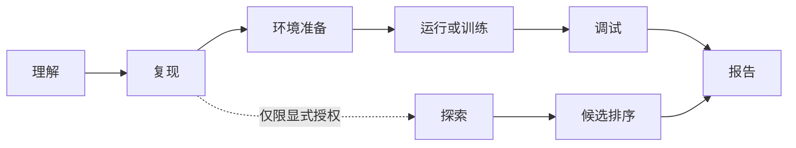
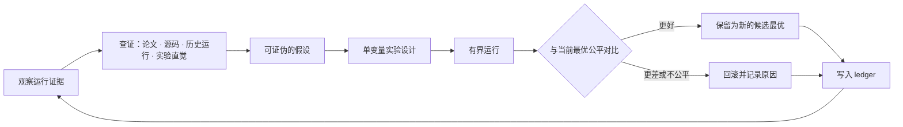

# RigorPilot Skills

把研究仓库的 README 命令转化为有界执行和可审计证据的科研 Harness。
默认走可信复现；只在显式授权后进入探索。不只是更高分数，而是可验证的研究进展。

<p>
  <a href="./README.md">English</a> |
  <a href="./README.zh-CN.md">简体中文</a>
</p>

<p>
  <a href="https://github.com/lllllllama/RigorPilot-Skills/actions/workflows/validate.yml"></a>
  <a href="https://skillselion.com/skills/lllllllama/rigorpilot-skills/ai-research-reproduction"></a>
  <a href="https://skills.sh/lllllllama/rigorpilot-skills"></a>
  <a href="https://github.com/lllllllama/RigorPilot-Skills/stargazers"></a>
  <a href="LICENSE"></a>
  <a href="https://agentskills.io"></a>
  
  
  
</p>

<p align="center">
  <a href="#examples"><strong>效果示例</strong></a> ·
  <a href="#evidence"><strong>真实仓库证据</strong></a> ·
  <a href="#quick-start"><strong>快速安装</strong></a> ·
  <a href="#-该用哪个入口"><strong>技能索引</strong></a>
</p>

<a id="examples"></a>

## 📄 一眼看懂：RigorPilot 如何批注 README

RigorPilot 直接读取目标仓库的原始 README，保留其中每一个字、空行和换行符，
只在各章节末尾插入状态卡片。你无需翻日志，就能先看清“做了什么、结果如何、
为什么停下”；需要核查时，再点击卡片里的证据链接下钻。

| 原始 README | RigorPilot 就地批注 | 可核查证据 |
|---|---|---|
| 命令、正文、徽章、图片、GIF、视频和 HTML 保持原样 | 成功、部分完成、阻塞、仅阅读或等待授权 | `SUMMARY.md`、`COMMANDS.md`、`LOG.md`、`status.json` |

🟢 执行成功 · 🔵 未执行 · ⚪ 仅阅读 · 🟡 部分完成 · 🔴 阻塞 · 🟣 需要决策

<div align="center">
  
  <br/>
  <sub>同一条评测命令从 checkpoint 缺失到资产就绪；训练没有授权时保持不执行。</sub>
</div>

| 可复核演示 | 你会看到 |
|---|---|
| [首次尝试](examples/annotated-readme-demo-zh/first-run/ANNOTATED_README.md) | 🟡 checkpoint 缺失与真实错误摘录 · 🟡 数据未就绪 · 🟣 训练等待授权 |
| [资产就绪后](examples/annotated-readme-demo-zh/after-setup/ANNOTATED_README.md) | 🟢 同一评测命令成功，并记录实际观测的 `mIoU` / `aAcc` |

### 真实公开仓库验证：micrograd

| 实际执行 | 原文完整性 | 直接查看 |
|---|---|---|
| 🟢 `2` 项测试通过（7.62 秒） | `8` 个标题 = `8` 条批注；剥离批注后 SHA-256 与原文件完全相同 | [原始仓库](https://github.com/karpathy/micrograd/tree/7bc720e951fe422b8f8814aa5aa1b64121d26b4c) · [保留原仓库文件的完整批注 README](benchmark_outputs/showcases/micrograd/repo/RIGORPILOT_README.md) · [benchmark 报告](benchmark_outputs/external_micrograd.json) |

<a id="evidence"></a>

## 🧪 已完成的真实公开仓库复现

<table>
  <tr>
    <td align="center" width="50%">
      <a href="benchmark_outputs/showcases/micrograd/repo/RIGORPILOT_README.md"></a><br/>
      <b>micrograd · 正确性验证</b><br/>
      <sub>🟢 2 项测试在 7.62 秒内通过 · 8 个标题 = 8 条批注<br/>原仓库文件保留 · SHA-256 完全一致</sub><br/>
      <a href="benchmark_outputs/showcases/micrograd/repo/RIGORPILOT_README.md">打开真实仓库内的 RigorPilot README →</a>
    </td>
    <td align="center" width="50%">
      <a href="benchmark_outputs/showcases/mingpt/repo/RIGORPILOT_README.md"></a><br/>
      <b>minGPT · 风险边界</b><br/>
      <sub>🔵 已选定测试 · 未隐式下载模型<br/>11 个标题 = 11 条批注 · SHA-256 完全一致</sub><br/>
      <a href="benchmark_outputs/showcases/mingpt/repo/RIGORPILOT_README.md">打开真实仓库内的 RigorPilot README →</a>
    </td>
  </tr>
  <tr>
    <td align="center" width="50%">
      <a href="benchmark_outputs/showcases/pytorch-mnist/repo/mnist/RIGORPILOT_README.md"></a><br/>
      <b>PyTorch MNIST · 数据与指标捕获</b><br/>
      <sub>🟡 有界启动 · 损失 0.038893<br/>1 个标题 = 1 条批注 · SHA-256 完全一致</sub><br/>
      <a href="benchmark_outputs/showcases/pytorch-mnist/repo/mnist/RIGORPILOT_README.md">打开真实仓库内的 RigorPilot README →</a>
    </td>
    <td align="center" width="50%">
      <a href="benchmark_outputs/showcases/nanogpt-shakespeare/repo/RIGORPILOT_README.md"></a><br/>
      <b>nanoGPT Shakespeare · 有界训练</b><br/>
      <sub>🟡 训练损失 4.1676 · 验证损失 4.1649<br/>11 个标题 = 11 条批注 · SHA-256 完全一致</sub><br/>
      <a href="benchmark_outputs/showcases/nanogpt-shakespeare/repo/RIGORPILOT_README.md">打开真实仓库内的 RigorPilot README →</a>
    </td>
  </tr>
</table>

<p align="center">
  <a href="benchmark_outputs/EXTERNAL_REPRODUCTIONS.zh-CN.md"><b>在一个证据索引中查看全部四项复现 →</b></a>
</p>

<sub>卡片内的英语来自外部仓库原始 README 与实际生成的英文证据文件；页面说明统一使用中文。</sub>

**已记录结果：** `59/59` 回归脚本、`4/4` 外部用例协议通过；
外部测试套件用时 `251.0 s`，单工作区最高 `98.67 MiB`，`0` 次 API 调用；
临时工作区全部删除，另保留约 `17.9 MiB` 的四个 tracked 仓库展示快照。

[最新测试套件 JSON](benchmark_outputs/external_suite_latest.json) ·
[历史记录](benchmark_outputs/external_suite_history.jsonl) ·
[用例定义](benchmarks/external_cases.json) ·
[方法与限制](benchmarks/README.md)

> `partial` 只证明有界启动、指标捕获、超时处理、源码完整性与清理能力；
> 不证明训练收敛，也不等于论文分数复现。

<a id="quick-start"></a>

## 🚀 安装

安装全部技能：

```bash
npx skills add lllllllama/rigorpilot-skills --all
```

只安装可信复现技能：

```bash
npx skills add lllllllama/rigorpilot-skills --skill ai-research-reproduction
```

<details>
<summary>其他安装方式、代理命令与运行时控制</summary>

可选模型执行入口：[运行与恢复已审核任务](skills/ai-research-reproduction/references/agent-runner.md)。
工程测试已覆盖恢复与独立验证；真实模型验收因网关 HTTP 502 暂未完成。
[P0/P1 实现记录与边界](docs/P0_P1_DELIVERY.md)。

Claude Code 命令：`/ai-research-reproduction`、`/ai-research-explore`、
`/analyze-project`、`/safe-debug`。

每条实际命令都有 run ID，并在 `<output-dir>/_runtime/<run_id>/` 下记录
原子状态、追加式事件、资源采样和完整 stdout/stderr。取消、重启恢复和
显式重试保留进程及 attempt 谱系；模型 profile 记录身份和能力，不记录凭据。

推荐源为 `lllllllama/rigorpilot-skills`；
`lllllllama/ai-paper-reproduction-skills` 仅作兼容 fallback。

</details>

## 📄 输出证据包

每次运行都会把原 README 和逐节结论写入
`repro_outputs/ANNOTATED_README.md`。每条结论都可直达 `SUMMARY.md`、
`COMMANDS.md`、`LOG.md` 和 `status.json`；文件头记录 rubric 式覆盖分。
🟢 成功 · 🔵 未执行 · ⚪ 仅阅读 · 🟡 部分完成 · 🔴 阻塞 · 🟣 需要决策。

## 🎯 该用哪个入口

| 你想做什么 | RigorPilot display name | 当前 skill slug |
|---|---|---|
| 从 README 命令出发复现深度学习仓库 | Rigor Reproduce | `ai-research-reproduction` |
| 只读分析仓库结构、入口、风险 | Rigor Analyze / Audit | `analyze-project` |
| 准备环境、数据、权重、缓存假设 | Rigor Setup | `env-and-assets-bootstrap` |
| 保守执行已记录的 inference / evaluation | Rigor Run | `minimal-run-and-audit` |
| 保守启动或验证训练 | Rigor Train | `run-train` |
| 安全调试失败，先诊断后 patch | Rigor Debug / Audit | `safe-debug` |
| 在 `current_research` 上做候选探索 | Rigor Explore | `ai-research-explore` |
| 在隔离分支实现候选改动 | Rigor Improve | `explore-code` |
| 做小样本 probe 或短周期试验 | Rigor Explore / Improve | `explore-run` |

内置 helper skills 通常由 orchestrator 调用：

- `repo-intake-and-plan`
- `paper-context-resolver`

## 🛣️ 两条主线

### 🔒 Trusted Lane

用于复现、环境准备、只读分析、保守执行、训练验证和安全调试。

- 主入口：`ai-research-reproduction`
- 输出目录：`repro_outputs/`、`train_outputs/`、`analysis_outputs/`、`debug_outputs/`
- 核心要求：保持科学含义不变，减少语义性改动，显式记录假设、blocker 和证据。

### 🧪 Explore Lane

只在研究者明确授权 candidate-only 探索时启用。

- 主入口：`ai-research-explore`
- 叶子技能：`explore-code`、`explore-run`
- 输出目录：`explore_outputs/`
- 核心锚点：`current_research`

`current_research` 应该是可追踪的研究状态，例如 branch、commit、checkpoint、run record 或已训练模型状态。Explore 结果始终是候选结果，不能声称已经完成可信复现、完整 benchmark 或已验证 novelty。

## 🔬 科研严谨性原则

1. 不盲目追分：分数提升必须有解释价值。
2. 不轻易声称创新：novelty 必须有文献、代码或实验依据。
3. 不破坏可比性：如果改变评估条件，必须说明结果不可直接比较。
4. 不隐藏工程修补：工程修补不能包装成方法贡献。
5. 不让合作者失控：重要修改必须可审计、可回滚、可解释。

详见 [references/research-rigor-principles.md](references/research-rigor-principles.md) 和 [references/agent-operating-principles.md](references/agent-operating-principles.md)。

## 🔁 生命周期视角

本仓库遵循一个浅层的、面向生命周期的路由模型：



生命周期帮助 agent 选择正确的 lane 和证据目标，但不会强迫每个仓库都走固定的实现顺序。

## 🧠 科研思维主循环

AI 的实现能力已经很强，但"思考"往往还停留在工程步骤上。在研究者冻结评测契约并显式授权探索后，`ai-research-explore` 执行一个成文的**贪心科研循环**——从观察出发，到一次公平的保留/回滚决策（[完整契约](references/research-thinking-loop.md)）：



- 每个假设必须带**标注来源的证据锚点**——`paper`、`code`、`prior-run` 或
  `intuition`；无锚点的想法进入 idea bank 排队，绝不直接执行。
- **贪心作用于选择，不作用于诚实**：保留决策必须基于冻结契约下的可比证据；
  平局时偏向更简单、更便宜的改动。
- 底层机制：硬门控的 idea 排序、原子化拆解、planned / heuristic / observed
  三层实现保真度、以及来自真实 executor 的文件级证据。
- 思想脉络：吸收 [AIDE](https://arxiv.org/abs/2502.13138) 的贪心解空间搜索与
  [AI-Scientist-v2](https://arxiv.org/abs/2504.08066) 的受管树搜索，再用
  RigorPilot 的可比性优先门槛加以约束。

## 🌱 持续学习与个性化

发布的技能是**不可变的通用科研素养内核**；个性化在用户自有的叠加层中发生（[策略](references/continuous-learning-policy.md)）：

- 失败的运行——以及后来的修复——会自动记录为单行经验，存入
  `~/.rigorpilot/lessons.jsonl`（`RIGORPILOT_LESSONS=0` 可关闭）。
- `python shared/scripts/lessons_store.py summarize` 将其提炼为
  `~/.rigorpilot/PERSONAL_RIGOR.md`，技能在运行开始时读取，作为研究者的
  长期偏好与已知坑位。
- 硬性规则：经验**仅供参考**——永不放松严谨门槛、永不存储密钥、永不修改
  技能文件。删除该目录即回到通用基础版。

## 🧾 建议的科研证据体系

| Artifact | 作用 |
|---|---|
| `SCIENTIFIC_CHANGELOG.md` | 记录改了什么、为什么改、是否影响科学含义、是否仍可比较。 |
| `COMPARABILITY_REPORT.md` | 说明结果是否仍能与 README、论文、baseline 或 SOTA 参考比较。 |
| `REPRODUCIBILITY_NOTES.md` | 记录命令、配置、seed、checkpoint、数据集、环境假设和已知缺口。 |
| `NOVELTY_CLAIM.md` | 将可能创新写成假设，列出支持证据、缺失证据、限制和所需消融。 |
| `ABLATION_PLAN.md` | 说明需要隔离哪些变量才能验证候选改动。 |
| `EXPERIMENT_LEDGER.md` | 记录 run、指标、命令、artifact、变更文件和证据状态。 |

其中 `SCIENTIFIC_CHANGELOG.md`、`COMPARABILITY_REPORT.md` 和 `EXPERIMENT_LEDGER.md` 已由标准 trusted / explore writer 生成；其余名称（`REPRODUCIBILITY_NOTES.md`、`NOVELTY_CLAIM.md`、`ABLATION_PLAN.md`）是 future-compatible evidence concepts。

## 📁 输出目录

| 目录 | 内容 |
|---|---|
| `repro_outputs/` | trusted reproduction 输出包，含 `ANNOTATED_README.md` |
| `train_outputs/` | trusted training 输出包 |
| `analysis_outputs/` | 只读分析、research map、change map、eval contract、idea seeds、atomic idea map、implementation fidelity 等 |
| `debug_outputs/` | 安全调试诊断和 patch plan |
| `sources/` | free-first research lookup 记录、repo-local extraction 和可审计索引 |
| `explore_outputs/` | changeset、idea gate、experiment plan、manifest、ledger、candidate ranking 等 |

## 🧩 Campaign 输入

`ai-research-explore` 仍接受 `variant_spec.json`，更推荐使用 `research_campaign.json` 或 `research_campaign.yaml`。

稳定核心字段：

- `current_research`
- `task_family`
- `dataset`
- `benchmark`
- `evaluation_source`
- `sota_reference`
- `compute_budget`

可选字段：

- `candidate_ideas`
- `variant_spec`
- `research_lookup`
- `idea_policy`
- `idea_generation`
- `source_constraints`
- `feasibility_policy`

详见 [skills/ai-research-explore/references/research-campaign-spec.md](skills/ai-research-explore/references/research-campaign-spec.md)。

## 🌐 多代理、多模型

RigorPilot 在设计上就是模型无关的：

- **Agent Skills 标准**——每个技能都是符合规范的 `SKILL.md`
  （[agentskills.io](https://agentskills.io)），该格式已被 Claude Code、
  OpenAI Codex、Cursor、VS Code、Gemini CLI 等 30+ 工具采纳；
  `npx skills add lllllllama/rigorpilot-skills` 对它们通用。
- **`AGENTS.md` 路由**——根级 [`AGENTS.md`](AGENTS.md) 让 AGENTS.md 感知的代理
  （Codex、Cursor、Copilot、Gemini CLI、Aider、Zed 等）无需安装即可获得
  lane 模型、入口表和硬性规则。
- **同一契约，任意模型**——SKILL.md 指令不含任何模型特定的工具语法；
  证据包（`status.json`、`ANNOTATED_README.md` 等）与执行模型无关，
  GPT / Claude / Gemini 系代理产出的结果保持可比。
- **按客户端的镜像入口**——`skills/*/agents/openai.yaml` 与
  `.claude/commands/*` 让 Codex 和 Claude 的专属入口与 canonical contract 同步。

## 🛠️ 本地安装

只有在本地开发、需要 project-scoped 安装，或需要手动指定客户端目录时，才建议使用 Python 安装脚本。

```bash
python scripts/install_skills.py --client agents --target "$HOME/.agents/skills" --force
python scripts/install_skills.py --client codex --target "$HOME/.codex/skills" --force
python scripts/install_skills.py --client claude --target "$HOME/.claude/skills" --force
```

项目内安装示例：

```bash
python scripts/install_skills.py --client agents --target ./.agents/skills --force
python scripts/install_skills.py --client claude --target ./.claude/skills --force
```

这些命令按 Windows PowerShell 与 Linux shell 的共同用法编写；`$HOME/...` 和 `./...` 在两类环境中都可用。

## 💬 示例提示词

**可信复现**

```text
Use ai-research-reproduction on this deep learning research repo. Stay README-first, prefer documented inference or evaluation, avoid unnecessary repo changes, and write outputs to repro_outputs/.
```

**只读分析**

```text
Use analyze-project on this repo. Read the code, map the model and training entrypoints, and flag suspicious patterns without editing files.
```

**安全调试**

```text
Use safe-debug on this traceback. Diagnose the failure first, propose the smallest safe fix, and do not patch until I approve.
```

**候选探索**

```text
Use ai-research-explore with research_campaign.json. Treat the task family, dataset, evaluation source, and SOTA table as frozen inputs. Rank candidate ideas and write evidence outputs to analysis_outputs/ and explore_outputs/.
```

## ✅ 本地自检

一键全量（CI 同款入口）：

```bash
python scripts/run_all_tests.py
```

基础检查：

```bash
python scripts/validate_repo.py
python scripts/test_skill_registry.py
python scripts/test_trigger_boundaries.py
python scripts/test_operating_principles_structure.py
python scripts/test_claude_command_wrappers.py
python scripts/test_readme_selection.py
```

核心输出与 explore 回归：

```bash
python scripts/test_output_rendering.py
python scripts/test_readme_annotation.py
python scripts/test_train_output_rendering.py
python scripts/test_analysis_output_rendering.py
python scripts/test_safe_debug_output_rendering.py
python scripts/test_research_explore_dry_run.py
python scripts/test_research_explore_campaign_flow.py
python scripts/test_research_explore_artifact_consistency.py
python scripts/test_research_explore_variant_execution.py
python scripts/test_research_explore_nontraining_execution.py
python scripts/test_atomic_idea_decomposition.py
python scripts/test_idea_seed_generation.py
python scripts/test_implementation_fidelity.py
```

安装相关回归：

```bash
python scripts/test_bootstrap_env.py
python scripts/test_install_targets.py
python scripts/test_setup_planning.py
```

## 🧭 当前仓库快照

- 共 `11` 个 skill，其中 `9` 个 public skill，`2` 个 helper skill。
- 共 `6` 个 trusted-lane public skill，`3` 个 explore-lane public skill。
- `.claude/commands/` 下提供 `4` 个项目级 Claude Code wrappers。
- 根目录 `scripts/` 下共有 `59` 个 Python 脚本，其中 `55` 个是测试脚本。
- 文档和命令示例兼顾 Windows PowerShell 与 Linux shell。

## ⚠️ 当前限制

- 持久任务队列是单机、单写入者调度器；资源请求用于准入控制，不等于操作系统级 CPU、内存或 GPU 隔离。
- 外部 suite 覆盖四个仓库，但 minGPT 仅做选择验证，两个训练用例只证明有界启动，不证明收敛或论文结果复现。
- `run-train` 仍是受限训练监控器；长任务必须显式提交到该队列或外部调度器。
- trusted reproduction 避免静默语义改动。
- helper skills 保持窄职责，不作为公共兜底入口。
- exploratory work 必须与 trusted baseline 隔离。
- `ai-research-explore` 是受治理的 Rigor Explore 兼容 slug，不是开放式 autonomous research agent。

## 📚 参考文档

- [Research rigor principles](references/research-rigor-principles.md)
- [Deep learning experiment principles](references/deep-learning-experiment-principles.md)
- [Shared operating principles](references/agent-operating-principles.md)
- [Skill registry](references/skill-registry.json)
- [Routing policy](references/routing-policy.md)
- [Trigger boundary policy](references/trigger-boundary-policy.md)
- [Client compatibility policy](references/client-compatibility-policy.md)
- [Output contract](references/output-contract.md)
- [Research pitfall checklist](references/research-pitfall-checklist.md)

## 🧱 仓库定位

RigorPilot Skills 是面向深度学习实验的科研优先 skill 仓库。它关注科学含义、可比性、可复现性、协作者可控性和可审计边界；它帮助 agent 更可靠地推进研究工作，但不替代研究者判断。
