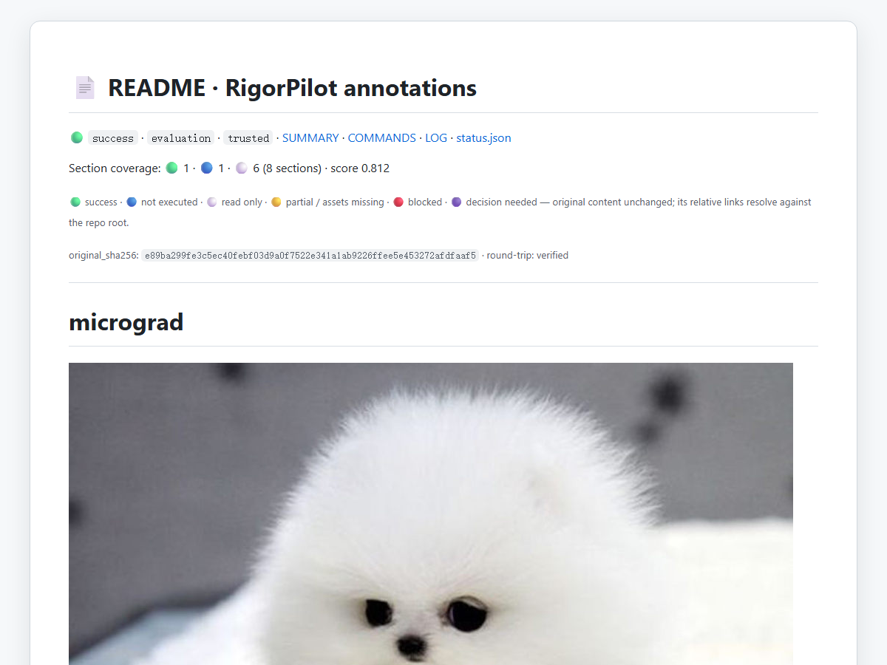
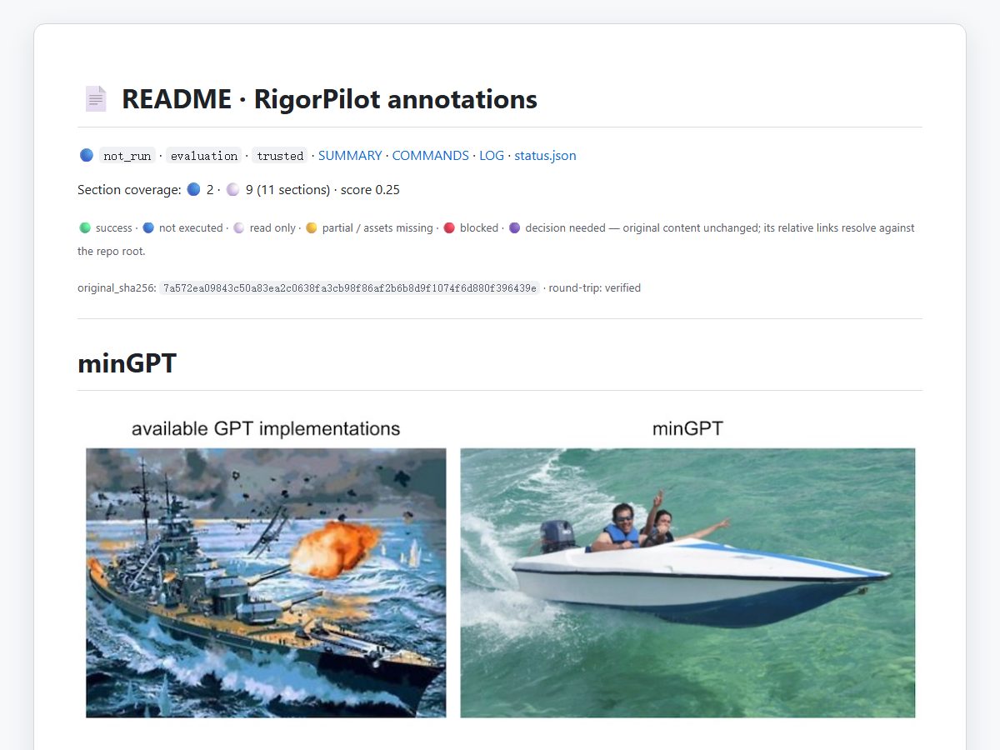
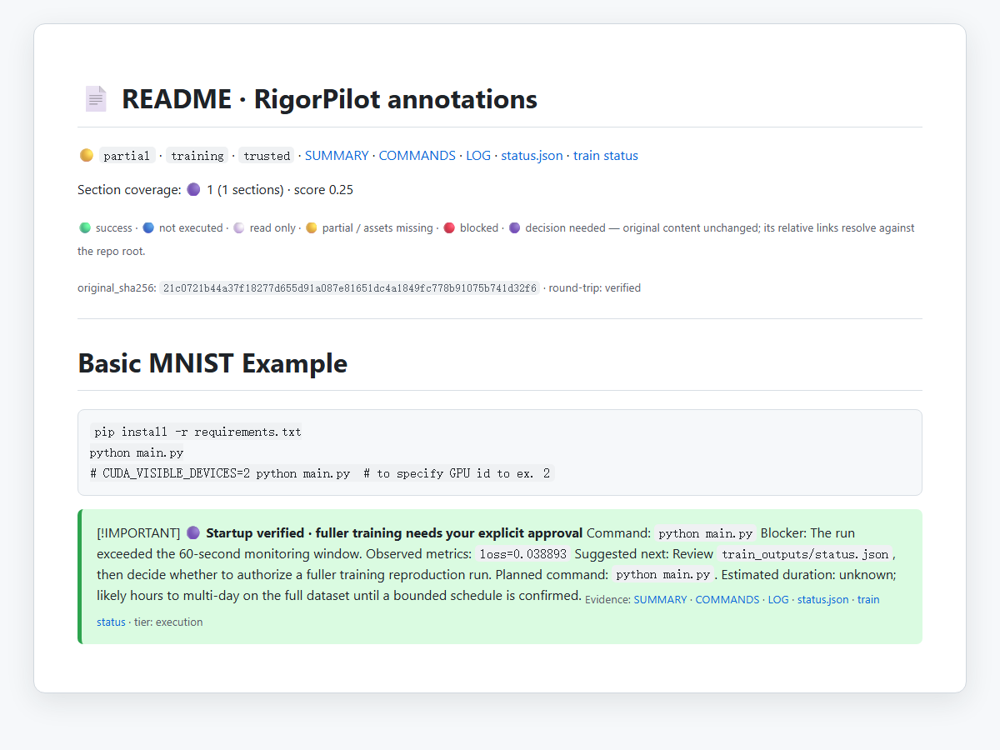
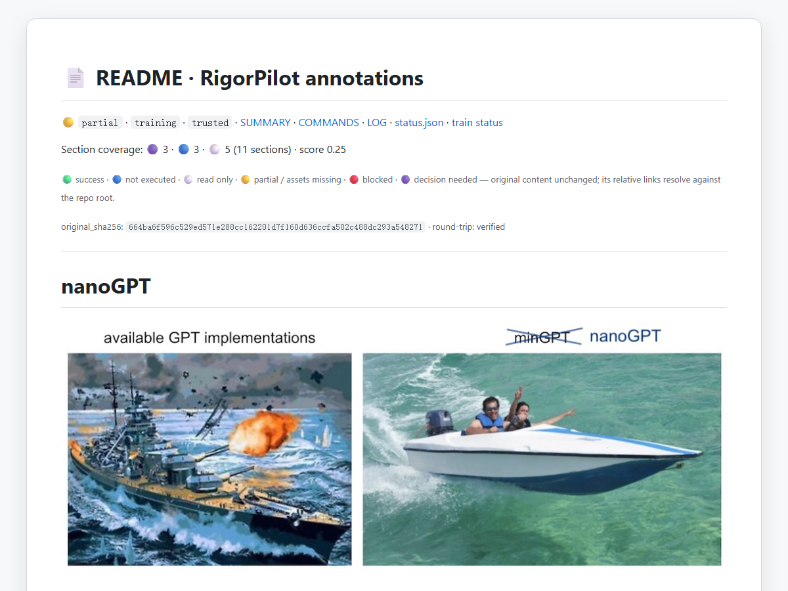
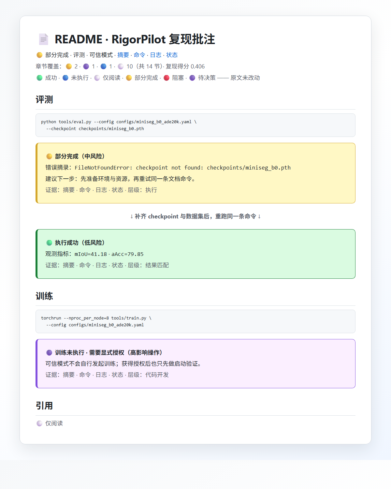

# RigorPilot Skills

从研究仓库的 README 出发，执行有界任务，留下可核查的证据。
RigorPilot 不重写原始 README，只在各章节插入执行结果与证据链接。
默认走可信复现；候选探索需要明确授权。

[English](README.md) · [简体中文](README.zh-CN.md)

[](https://skillselion.com/skills/lllllllama/rigorpilot-skills/paper-context-resolver)

<p>
  <a href="https://github.com/lllllllama/RigorPilot-Skills/actions/workflows/validate.yml"></a>
  <a href="https://skillselion.com/skills/lllllllama/rigorpilot-skills/ai-research-reproduction"></a>
  <a href="https://skills.sh/lllllllama/rigorpilot-skills"></a>
  <a href="https://github.com/lllllllama/RigorPilot-Skills/stargazers"></a>
  <a href="LICENSE"></a>
  <a href="https://agentskills.io"></a>
  
  
  <a href="benchmark_outputs/external_suite_latest.json"></a>
</p>

<p align="center">
  <a href="#examples"><strong>真实示例</strong></a> ·
  <a href="#quick-start"><strong>安装使用</strong></a> ·
  <a href="#skills"><strong>技能索引</strong></a> ·
  <a href="#validation"><strong>验证方式</strong></a> ·
  <a href="docs/ENGINEERING_ROADMAP.zh-CN.md"><strong>工程路线</strong></a>
</p>

<a id="examples"></a>
<a id="evidence"></a>

## 📄 真实仓库，可直接查看的结果

原始命令、正文、徽章、图片、视频和 HTML 保持不变。
RigorPilot 直接切分原文件，每个章节插入一条带证据链接的批注。
剥离全部插入块后，得到与保留的原始 README 逐字节一致的文件。

下方每张卡片都指向**保留的仓库副本中、与原 README 同目录的完整批注文件**。
相关仓库文件一并保留，相对链接和媒体仍处在原来的目录环境中。
截图内的英文来自原始仓库及其证据文件；本页说明统一使用中文。

🟢 所选检查通过 · 🔵 未执行 · ⚪ 仅阅读 · 🟡 部分完成 · 🔴 阻塞 · 🟣 待决策。
绿色不自动代表论文指标复现；蓝色不表示执行失败。

<table>
  <tr>
    <td align="center" width="50%">
      <a href="benchmark_outputs/showcases/micrograd/repo/RIGORPILOT_README.md"></a><br/>
      <b>micrograd · 正确性验证</b><br/>
      <sub>🟢 2 项测试在 7.62 秒内通过<br/>8 个标题 = 8 条批注 · 原文件字节不变</sub><br/>
      <a href="benchmark_outputs/showcases/micrograd/repo/RIGORPILOT_README.md">打开完整 RigorPilot README →</a>
    </td>
    <td align="center" width="50%">
      <a href="benchmark_outputs/showcases/mingpt/repo/RIGORPILOT_README.md"></a><br/>
      <b>minGPT · 目标选择边界</b><br/>
      <sub>🔵 已选定测试，未执行 · 未下载模型<br/>11 个标题 = 11 条批注 · 原文件字节不变</sub><br/>
      <a href="benchmark_outputs/showcases/mingpt/repo/RIGORPILOT_README.md">打开完整 RigorPilot README →</a>
    </td>
  </tr>
  <tr>
    <td align="center" width="50%">
      <a href="benchmark_outputs/showcases/pytorch-mnist/repo/mnist/RIGORPILOT_README.md"></a><br/>
      <b>PyTorch MNIST · 有界启动</b><br/>
      <sub>🟡 部分训练 · 观测损失 0.038893<br/>1 个标题 = 1 条批注 · 原文件字节不变</sub><br/>
      <a href="benchmark_outputs/showcases/pytorch-mnist/repo/mnist/RIGORPILOT_README.md">打开完整 RigorPilot README →</a>
    </td>
    <td align="center" width="50%">
      <a href="benchmark_outputs/showcases/nanogpt-shakespeare/repo/RIGORPILOT_README.md"></a><br/>
      <b>nanoGPT Shakespeare · 有界训练</b><br/>
      <sub>🟡 部分完成 · 训练损失 4.1676 · 验证损失 4.1649<br/>11 个标题 = 11 条批注 · 原文件字节不变</sub><br/>
      <a href="benchmark_outputs/showcases/nanogpt-shakespeare/repo/RIGORPILOT_README.md">打开完整 RigorPilot README →</a>
    </td>
  </tr>
</table>

[四项用例与原始仓库链接](benchmark_outputs/EXTERNAL_REPRODUCTIONS.zh-CN.md) ·
[已记录的测试套件](benchmark_outputs/external_suite_latest.json) ·
[用例定义](benchmarks/external_cases.json) · [评测方法](benchmarks/README.md)

这是固定提交上的历史确定性执行记录：**4/4 用例协议**通过，
用时 `251.0 s`，工作区峰值 `98.67 MiB`，模型 API 调用 `0` 次。
零 API 仅指这次确定性套件；仅选择目标和部分训练，不代表完成评测、
训练收敛或复现论文分数。

新增：[安装后 micrograd 真实试用](docs/FIRST_USE_ACCEPTANCE.zh-CN.md)——保留修改前后命令报告、失败尝试与独立验收，不把它当作模型能力对照。

<a id="quick-start"></a>

## 🚀 安装使用

安装器需要 Node.js/npm；若出现 `EBADENGINE`，请先核对安装器要求的 Node 版本。

安装全部技能：

```bash
npx skills add lllllllama/rigorpilot-skills --all
```

或仅安装可独立使用的复现主技能：

```bash
npx skills add lllllllama/rigorpilot-skills --skill ai-research-reproduction
```

在支持 Skills 的代理中打开目标仓库，然后输入：

> 使用 ai-research-reproduction，运行 README 中最小的已记录评测，保留原始源码并将证据写入 repro_outputs/，另生成与原 README 同目录的批注副本。大规模下载或长训练前先确认。

主技能可以单独使用；其他配套入口和叶子技能请选择**安装全部技能**。
由你已有的代理加载技能，不必使用本项目的独立模型执行器。
[客户端兼容说明](references/client-compatibility-policy.md)

完成后先打开报告中 `source_adjacent_readme.path` 指向的 `RIGORPILOT_README.md`，
再点击批注里的命令和日志链接。若额外副本因同名文件等原因被阻止，原文件不会
被覆盖，仍可从 `repro_outputs/SUMMARY.md` 查看结果与下一步。

## 能做什么，以及边界

README → 文档目标 → 审核准备步骤 → 有界执行 → 验收 → 证据。

- 保持源码的科学含义，记录假设、偏差、失败与阻塞原因。
- 保存进程状态、日志和尝试历史；持久运行时支持显式取消、恢复与重试。
- 区分可信复现和明确授权的候选探索。
- 独立检查执行条件，不以模型声称完成作为成功依据。

这是**本机执行，不是操作系统沙箱**。已授权命令可以访问宿主机和网络，
请仅运行可信仓库。资源准入和步骤间预算检查不是系统级硬配额，
也不能监控订阅余额。

可选模型执行器目前支持 Anthropic Messages 协议与预先审核的命令编号，
不支持不受限的源码修复。**该独立执行器尚无成功的真实模型验收记录**：
三次服务调用均返回 HTTP 502。其他模型配置仅记录元数据，
不代表已实现相应服务接入或证明不同模型效果等同。
[执行与恢复契约](skills/ai-research-reproduction/references/agent-runner.md) ·
[实现证据与限制](docs/P0_P1_DELIVERY.md)

<a id="skills"></a>

## 🎯 技能索引

| 任务 | 技能 |
|---|---|
| 从 README 命令出发复现 | [`ai-research-reproduction`](skills/ai-research-reproduction/SKILL.md) |
| 只读分析仓库 | [`analyze-project`](skills/analyze-project/SKILL.md) |
| 准备环境、数据与权重 | [`env-and-assets-bootstrap`](skills/env-and-assets-bootstrap/SKILL.md) |
| 执行已记录的推理或评测 | [`minimal-run-and-audit`](skills/minimal-run-and-audit/SKILL.md) |
| 保守启动或验证训练 | [`run-train`](skills/run-train/SKILL.md) |
| 先诊断，再提出修复方案 | [`safe-debug`](skills/safe-debug/SKILL.md) |
| 协调已授权的候选探索 | [`ai-research-explore`](skills/ai-research-explore/SKILL.md) |
| 在隔离分支实现候选改动 | [`explore-code`](skills/explore-code/SKILL.md) |
| 执行有界候选实验 | [`explore-run`](skills/explore-run/SKILL.md) |

另有两个编排辅助技能：`repo-intake-and-plan`、`paper-context-resolver`。
探索需要可追踪的 `current_research` 状态和固定的比较条件；
候选结果不能仅凭声明变成可信基线。
[路由规则](references/routing-policy.md) · [科研循环](references/research-thinking-loop.md) ·
[实验任务输入](skills/ai-research-explore/references/research-campaign-spec.md)

## 📦 输出证据包

| 文件 | 可以核查什么 |
|---|---|
| `repro_outputs/ANNOTATED_README.md` | 原始 README 与逐节插入的结论 |
| `SUMMARY.md`、`COMMANDS.md`、`LOG.md`、`status.json` | 结果、实际命令、观察记录与机器可读状态 |
| `PATCHES.md`、`SCIENTIFIC_CHANGELOG.md`、`COMPARABILITY_REPORT.md` | 修改、科学含义与可比性边界 |
| `_runtime/<run_id>/` | 进程状态、事件、资源采样与标准输出和错误日志 |
| `agent_state.json`、`trajectory.jsonl` | 可选模型执行器的检查点、工具调用与已报告用量 |

🟢 成功 · 🔵 未执行 · ⚪ 仅阅读 · 🟡 部分完成 · 🔴 阻塞 · 🟣 需要决策

常规证据仍位于 `repro_outputs/`。两个主执行入口均可加
`--source-adjacent-readme`，在原 README 旁生成 `RIGORPILOT_README.md`，
保留原文相对媒体和文件链接的目录上下文；仅调整新增批注中的证据链接。
同一输出目录可刷新未被改动的自有副本，不覆盖无关或被手动编辑的同名文件。
请保留原仓库相关文件及证据目录中的 `readme_delivery.json`。
[输出契约](references/output-contract.md) · [科研严谨性原则](references/research-rigor-principles.md)

<a id="validation"></a>

## ✅ 离线验证

克隆本项目，安装 Python 3.11+ 和 Git 后运行：

```bash
python scripts/run_harness_lab.py
```

这个离线示例采用**预设决策、真实进程**，验证失败 → 准备 → 暂停 →
控制进程重启 → 独立验收，不调用 API、不使用 GPU、不下载模型。
打开命令输出中的 `REPORT.json` 及其关联证据即可核查。
已有输出不会被覆盖；再次运行可加 `--output tmp/check-2`。
它不是真实模型能力证明。[示例源码与检查项](examples/harness-lab/README.md)

运行仓库回归套件：

```bash
python scripts/run_all_tests.py
```

最近本地记录（2026-09-06）：**68/68 脚本通过，用时 141.5 秒**。
持续集成徽章链接指向 Windows、Linux 和 macOS 的最新结果。
本地测试不能替代真实模型验收或未见任务评估。

准备模型对照可用[小型评测工具](docs/PAIRED_PILOT.zh-CN.md)：提供冻结任务和
真实评分器校准日志。六个计划中的模型试验尚未运行；校准不代表技能增益。

[受控试验检查](docs/CONTROLLED_TRIALS.zh-CN.md)提供真实失败与恢复日志、受限工具
和未知用量停止验证；模型响应为脚本化测试数据。

## 工程与贡献

[工程路线](docs/ENGINEERING_ROADMAP.zh-CN.md) · [贡献指南](CONTRIBUTING.md) ·
[安全与问题报告](SECURITY.md) · [持续集成配置](.github/workflows/validate.yml) ·
[提交复现反馈](https://github.com/lllllllama/RigorPilot-Skills/issues/new?template=reproduction.yml) ·
[MIT 许可证](LICENSE)

保持验收独立，保留失败证据，发布前审查运行记录。
不要公开凭据或未经检查的私有仓库数据。
[代理协作说明](AGENTS.md) · [执行原则](references/agent-operating-principles.md) ·
[个性化策略](references/continuous-learning-policy.md)

<details>
<summary>历史界面示意，不作为执行证据</summary>



[首次尝试](examples/annotated-readme-demo-zh/first-run/ANNOTATED_README.md) ·
[准备完成后](examples/annotated-readme-demo-zh/after-setup/ANNOTATED_README.md)。
这份旧 MiniSeg 预览只展示错误、指标和授权状态的呈现方式。
其执行来源没有独立核验，不计入基准测试。

</details>
