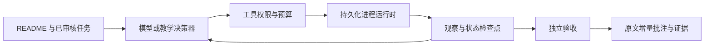

# RigorPilot：学习、验收与产品路线

[English](PROJECT_GUIDE.md) · [首页](../README.zh-CN.md) · [工程记录](P0_P1_DELIVERY.md)

本评估基于 2026-09-06 的代码和公开证据。下面的时间是单人开发估算，
不是完成承诺；真实模型服务、第三方仓库和用户反馈可能改变排期。

## 1. 项目究竟解决什么问题

定位为**可审计的科研仓库执行 Harness**：把 README 中已审核的运行目标，
变成有边界、可恢复、能核查的执行记录。不是通用自主科学家，也不是仅靠
提示词改善回答的包装。最适合小型评测、复现前的可行性检查、训练启动核验。

价值假设是：研究者能更快辨别“运行成功、部分完成、环境阻塞、指标不匹配”，
减少误报与人工排查时间。这个假设仍需要对照实验和外部用户验证。

| 维度 | 已有基础 | 不能据此声称什么 |
|---|---|---|
| 原文与展示 | 固定版本仓库、保留文件和媒体、插入块可剥离并还原 README 字节 | Markdown 字节完整不保证所有上游远程媒体永久在线 |
| 执行机制 | 真实子进程、状态、事件、取消、恢复与命令预算 | 本机执行不是 OS 沙箱；预算检查不是硬磁盘配额 |
| 决策层 | Anthropic Messages 工具循环、已审核命令选择、独立完成检查 | 不能自主修改源码；其他 provider 的 metadata 不等于调用支持 |
| 现有外部评测 | micrograd 测试；minGPT 仅选择；两项短训练的部分记录 | 四项协议通过不是四篇论文复现，更不是陌生任务成功率 |
| 真实模型 | 三次 HTTP 502 失败记录保留 | 没有成功的 live model 验收；未返回用量不代表免费 |
| 学习实验 | 可运行的离线失败—恢复实验，真实进程、模拟决策 | 不是模型智能、自动诊断或学习能力证明 |

最强的差异化是“把执行证据放回研究者本来就在看的 README”。最弱的是
“这些护栏究竟比同一个模型裸跑带来多少收益”尚未量化。继续堆 skill、模型名、
截图或多 Agent 数量不能回答后一个问题。

还需注意普通运行的 `repro_outputs/ANNOTATED_README.md` 位于子目录，
上游相对媒体路径可能无法在那里直接显示；现有公开展示和教学实验另外提供
源文件旁的 `RIGORPILOT_README.md`，保留了正确上下文。把这种可选发布能力
推广到普通入口，配合嵌套 README/相对图片测试，是后续首次体验优化项。

## 2. 先亲手跑通，再读架构

从克隆后的项目根目录运行（Python 3.11+、Git；无 API、GPU、模型下载）：

```bash
python scripts/run_harness_lab.py
```

这是专门标注的教学夹具，预置决策，真实执行。输出路径和证据入口由命令打印；
已有目录不会覆盖。读 `REPORT.json`、暂停状态、最终 `agent_state.json`、
`trajectory.jsonl` 和相邻批注 README，解释为什么有三次命令执行但只有一次准备。
用 `--output tmp/my-lab-2` 创建新的实验，不把模拟结果混入真实模型 benchmark。



按顺序阅读，每层只回答一个问题：

| 层 | 入口 | 你要能独立解释 |
|---|---|---|
| Skill 契约 | [SKILL.md](../skills/ai-research-reproduction/SKILL.md) | 谁决定权限？为什么默认不探索？ |
| 任务与模型 | [run_agent.py](../skills/ai-research-reproduction/scripts/run_agent.py)、[agent_provider.py](../shared/scripts/agent_provider.py) | 模型能选什么？配置是否真的被发送？ |
| 执行与恢复 | [runtime_runner.py](../shared/scripts/runtime_runner.py) | 进程执行了但结果没存下时，能不能重跑？ |
| 独立验证 | [test_agent_runner.py](../scripts/test_agent_runner.py) | 为什么模型说“完成”不能直接变成 success？ |
| 证据与发布 | [check_publication.py](../scripts/check_publication.py) | 为什么本地文件存在不代表 GitHub 用户能看到？ |
| 全生命周期 | [run_all_tests.py](../scripts/run_all_tests.py) | 改动如何经过本地回归、安装验收、三平台 CI？ |

建议你亲自完成三项练习，保留自己的分析而不只保留 AI 生成代码：

1. 在新的教学实验中把验收条件改错，预测结果，再解释为什么不能成功。
2. 为一个尚未覆盖的恢复边界写失败测试，先看测试失败，再改实现。
3. 对一次改动写半页 ADR：问题、两个候选方案、取舍、验证、未解决风险。

## 3. 以验收门槛推进，而不是以功能数量推进

| 阶段 | 范围与估算投入 | 完成门槛 |
|---|---|---|
| 现在：可靠性与首次体验 | 修安装、假成功、配置失真；补离线学习实验 | 全套回归和安装路径通过；坏输入不能变成成功；不覆盖用户输出 |
| 下一步：真实模型 canary，约半天至一天 | 可用 endpoint 下只跑一例 micrograd | 保存实际模型回复、工具轨迹、退出码、用量、验证结果和原文哈希；无人工替写轨迹 |
| 小型效果对照，约 2–4 天 | 6 个任务 × 3 条件 × 首轮 1 次 | 所有失败入账；逐项人工核查 grader；同时报告正确成功、误报、干预、时间和费用 |
| 回归评测集，约 3–5 天 | 12 个冻结任务、4–6 仓库；重要项重复 3 次 | 开发集与保留集分开；新增 bug 进入回归集；模型升级可成对比较 |
| 真实用户试用，约 1–2 周日历时间 | 5–10 位目标用户、一个版本、一条短任务 | 记录首次成功率、首次成功时间、重复使用和失败类别；收集同意后才引用反馈 |

优先串行，先 1 例、再 3 例、再小矩阵。首次真实调用仍然 502 时立即记录并停下，
不要反复切模型碰运气。费用预算由用户在服务端设置；Harness 的 token/时间上限
不等于订阅余额监控，不能保证“余额不低于 60%”。

暂缓：大规模 GPU 训练、自由源码修补、自动下载大模型、多代理辩论、向量记忆库、
重型可视化平台。缺 OS 隔离时不要向陌生仓库开放任意执行权限。

## 4. 怎样证明 Harness 真的有用

这是待实现的 P2 实验协议，不是已有成绩。先固定任务、资源和验收器，再跑模型。

三条条件：A 为同模型+通用任务提示；B 为同模型+RigorPilot skill 指令；
C 为 B+持久化执行/恢复/证据机制。使用相同模型版本、工具权限、审核命令集合、
终止预算、初始仓库与环境。A/B 也由实验控制器保留原始轨迹，不能因没有漂亮
报告就被判业务失败。若工具权限或命令集合不同，标记为产品端到端比较，
不得解释为 Harness 单因素收益。命令已预审的任务也不能证明自主目标发现能力。

第一批六种任务：正常小评测、缺资源后准备重试、程序成功但验收不符、
命令成功后控制器中断、模型提前宣告成功、需要未授权的大额下载。
真实仓库任务与注入故障分开标记；精确 commit、测试条件、故障注入和目标结果
在运行前冻结。现有公开四仓库用作开发/回归，不冒充从未看过的保留集。

当前模型循环的退出码/输出字串检查只覆盖轻量执行条件。P2 应增加任务专用的
外部验收器：检查实际产物、指标容差和评测条件，保护评分器不被执行中的 Agent
修改。不要把“打印了成功文字”当作完成了研究任务。

每条结果至少记录：task ID、split、repo commit、harness/prompt/grader hash、
模型请求名与实际返回名、参数、依赖/缓存/硬件条件、重复编号、人工干预、
模型自报结论、独立 verdict、事件链接、输入/输出 token、费用是否已知、耗时。
provider 失败单列，但不从所有任务的用户成功率分母中删除；另报服务可用时成功率。

重点指标：

- 正确任务完成率；“未完成却宣告成功”的比例与原始计数。
- 安全阻塞率与错误阻塞率，避免靠全部拒绝刷安全分。
- 每个成功任务的成本（包含失败尝试成本）、人工介入次数、恢复重复执行次数。
- 证据链接/原文完整性另列；运行成功、研究指标匹配、报告完整不是同一个分数。

小样本先给逐例结果和不确定性，不宣传泛化百分比。提前写明主要指标和停止规则；
调 prompt 时只看开发集，冻结后才看保留集。任何误报成功先阻止发布；如果成功率
持平但人工排查时间明显降低，也可以形成有效产品价值，不必强求分数全面领先。
这与 [Anthropic 的 agent eval 方法](https://www.anthropic.com/engineering/demystifying-evals-for-ai-agents)
强调的完整执行轨迹和明确判定标准一致。

## 5. 借鉴先进 Harness，但保留自己的判断

[Anthropic 的长任务实践](https://www.anthropic.com/engineering/harness-design-long-running-apps)
展示了先约定验收条件、再执行和独立评价的思路，也展示了模型进步后删除旧脚手架的可能。
本项目应该借鉴“可验证的契约”和“按实测删减机制”，不是直接照搬三代理架构。
[LangGraph 的持久化设计](https://docs.langchain.com/oss/python/langgraph/persistence)
区分单任务检查点与跨任务记忆；本项目先把前者做可靠，再考虑后者。

每次模型升级：先做协议/用量契约测试→一个真实 canary→同条件保留集成对对照。
比较正确性、误报、成本和人工干预；暂不删除旧结果。Prompt、工具、模型版本
一次只变一个因素。若新模型不再需要某条补救提示，先做消融再删除，不永久堆规则。
不要把 capability 标签或某个 gateway 的兼容性推广为全模型支持。

## 6. 求职：展示完整开发过程，而不是只展示成品

更适合讲述为 Agent 应用工程、评测/可靠性工程、科研工具开发项目，暂不包装为
模型训练研究成果或分布式生产平台。公开的 [Model Evaluations 岗位](https://job-boards.greenhouse.io/anthropic/jobs/5198255008)
关注指标定义、可靠执行、异常归因、实验和沟通；这是能力参照，不是入职保证或国内岗位全貌。

准备三段可现场演示的故事：

1. **防止假成功**：命令名称与内部字段冲突为何会让没运行的任务通过；
   先复现，再结构化隔离验证命名空间，用反例测试约束修复。
2. **恢复语义**：为什么不能把一次不确定的执行当作“失败后重试”；
   展示检查点、run ID、真实进程输出和不重复执行的证据。
3. **交付一致性**：开发目录能跑、安装目录不能跑，或本地媒体存在、远程缺失；
   展示安装隔离测试和 Git tree 哈希检查如何覆盖用户真正拿到的内容。

简历可写“实现 README 原文保留、受限工具执行、持久化恢复、独立验收和跨平台回归”；
只有在自己能解释且亲手验证后才写为个人能力。模型提升百分比、节省费用、
生产用户规模只填真实数据；AI 协作方式和自己的设计/验证工作如实说明。

## 7. GitHub：把关注转化成第一次成功

首页保持两个安装命令、并列真实仓库示例、短效果说明和证据深链。
历史 MiniSeg 界面示意与固定 commit 的实跑证据分开标记；不美化失败。
新增离线实验服务首次体验，live canary 服务真实能力验收，两者不能混用。

优先发布一段 60–90 秒未经剪辑伪造结果的真实演示：启动任务→看到状态→
打开批注→点击原始日志。然后围绕同一版本邀请 5–10 位研究/Agent 开发用户试用，
通过 [复现反馈表](https://github.com/lllllllama/RigorPilot-Skills/issues/new?template=reproduction.yml)
收集阻塞，并把真实失败转为测试。是否发帖、邀请用户和创建 release，由维护者决定。

Star 是传播信号，不是使用量。更可控的目标是首次成功时间、无需维护者帮助的比例、
一周后重复使用人数和外部贡献。先让真实用户愿意再次使用，再扩大传播；
任何路线都不能保证高 Star 或面试录用。
